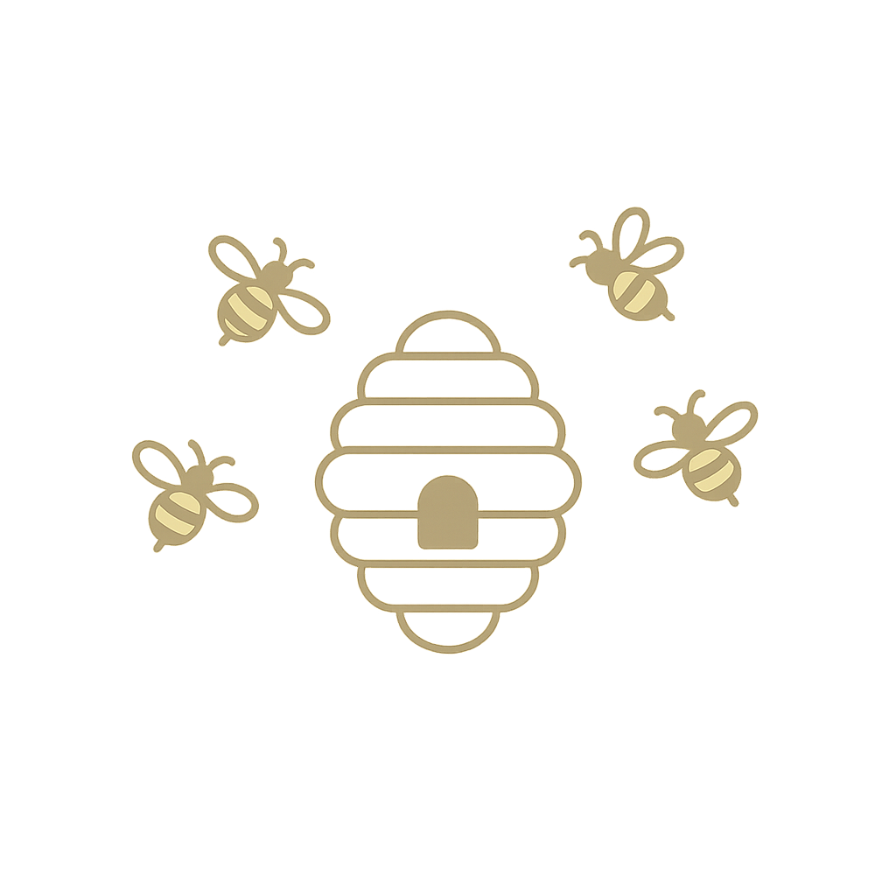

<h1 align="center">
  Hi, I'm Giusy 
  
</h1>

  <i>“Small steps, big dreams.”</i> 
  Web developer in love with clean code and beautiful design.

---

###  About Me

I'm a Computer Engineering graduate and I love building elegant, functional, and user-friendly websites — like a well-crafted beehive.

  

Currently focusing on:

- Modern frontend development  
- Personal projects crafted with care and creativity  

  

### Featured Projects

- [`portfolio`](https://github.com/sommag/portfolio) — My personal portfolio  
- [`nautical-rent`](https://github.com/sommag/nautical-rent) — Boat rental platform with style  
- [`petfamily`](https://github.com/sommag/petfamily) — A love letter to animals   

---

### Tech Stack

  

---

### A Bit More About Me

-  I believe in merging code with creativity  
-  Always learning, always improving  
-  Let’s connect on [LinkedIn](https://www.linkedin.com/in/giusy-somma)  

---

  

